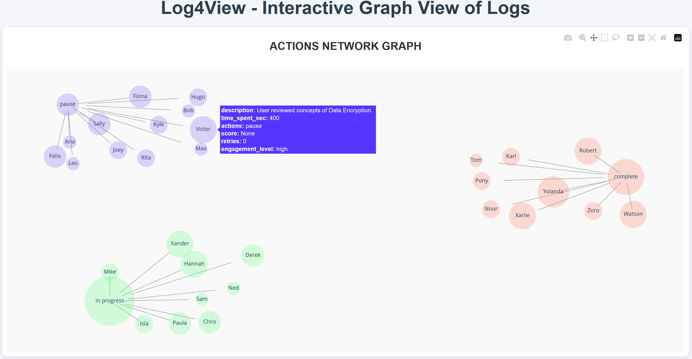

# Log4view

Welcome to log4view! This tool leverages the power of NetworkX and Plotly to transform raw logs into visually compelling network graphs, offering a new dimension to log data interpretation. Whether you're a network engineer, data scientist, or just curious about your log data, this program provides insightful visualizations that help you understand and explore complex networks.

## TL;DR

Log4view is a tool for technical people who work with logs to view their data in a more visually stimulating way - in the hopes of bringing new insights and ideas. Log4view will generate up to 25 nodes per page, and 5 pages total. This is hardcoded, but you can edit the variables, which are *acceptable_number_of_nodes_in_page*, and *num_of_pages*. Ideally you will work with up to a couple hundred logs, but if you choose to expand the above variables, the sky's the limit.

Log4view accepts a file path to your data, and a secondary key. The tool will then create main nodes made up of secondary keys, and sub-nodes of the main outer key of your data structure.

Do reach out here for any ideas and feedback - good or bad :)



## Table of Contents

- [Features](#features)
- [Installation](#installation)
- [Usage](#usage)
- [Modules](#modules)
- [Contributing](#contributing)
- [License](#license)

## Features

- **Interactive Visualizations**: Navigate through complex network structures with dynamic, zoomable, and draggable graphs.
- **Customizable Layouts**: Utilize different layouts to organize your data meaningfully.
- **Scalable**: Capable of handling small to large-scale network logs.
- **User-Friendly**: Intuitive interfaces for both non-technical and technical users.

## Installation

Follow these steps to run log4view on your local machine:

### Prerequisites

- Python 3.6+
- pip (Python package installer)

### Installation Steps

1. Clone the repository:
    ```bash
    git clone https://github.com/Trivulzianus/log4view.git
    cd log4view
    ```

2. Install the necessary packages:
    ```bash
    pip install -r requirements.txt
    ```

## Usage

To create a network graph from your logs, follow these simple steps:

1. Prepare your log data.
2. Run the program. You will be prompted to link the file path to your logs. You will also be required to enter a secondary key, which will be used to create the relationship between the nodes.
3. Load the data into the program. Ensure your logs are in JSON or CSV format.
4. Generate and explore the network graph.

```bash
python main.py <path_to_file>, <secondary_key>
```

## Modules

My project is modular to help you extend and modify it easily. Here's a brief overview of what each module does:

### 1. App Layout

The heart of the visual interface, responsible for setting up and customizing the layout of the graph. Choose from various styles to tailor the visualization to your needs.

### 2. Create Figure

This module transforms processed data into visual graphs. Utilizing Plotly's capabilities, it creates interactive figures ready for exploration.

### 3. Process Graph

Handles the core logic, processing raw log data into structured graph representations using NetworkX. Define nodes, edges, and relationships effortlessly.

## Contributing

I welcome contributions! Whether it's bug reporting, feature requests, or proposing changes.

1. Fork the repository.
2. Create your feature branch (`git checkout -b feature/AmazingFeature`).
3. Commit your changes (`git commit -m 'Add some AmazingFeature'`).
4. Push to the branch (`git push origin feature/AmazingFeature`).
5. Open a Pull Request.

## License

This project is licensed under the MIT License.

---

Start untangling your logs and uncover hidden insights with log4view! If you have any questions or need assistance, feel free to open an issue or reach out to us. Enjoy exploring your network data!
